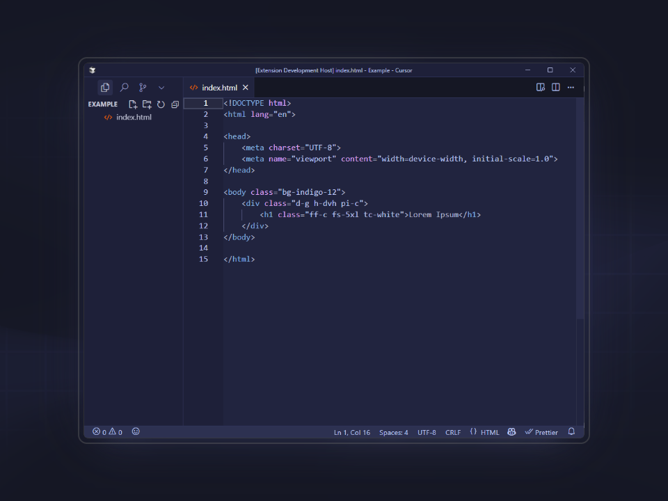

# [Eclipsa](https://marketplace.visualstudio.com/items?itemName=yumma-css.eclipsa)

A dark theme for VS Code and Cursor, inspired by Ariake Dark.

## Preview

This is what the theme looks like using Cursor:

## Theme

The default color palette of the theme.

| Color                                                               | Description                            |
| ------------------------------------------------------------------- | -------------------------------------- |
|  `#bec6f2` | Primary text & accents                 |
|  `#31365e` | Borders and subtle outlines            |
|  `#2d3151` | Selected item backgrounds              |
|  `#21243f` | Main background (panels, editor, etc.) |
|  `#1e2039` | Sidebar & title bar background         |
|  `#c4c7d9` | Secondary text                         |
|  `#ffffff` | Highlight text, hover & active states  |
|  `#424662` | Secondary button background            |
|  `#ccaf75` | Warning foreground                     |
|  `#ff9499` | Error foreground                       |
|  `#c1f0cc` | Added diff (insert background)         |

## License

Made by the [Yumma CSS Team](https://yummacss.com) under the [MIT License](LICENSE).
